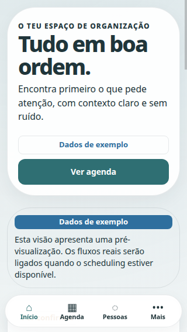
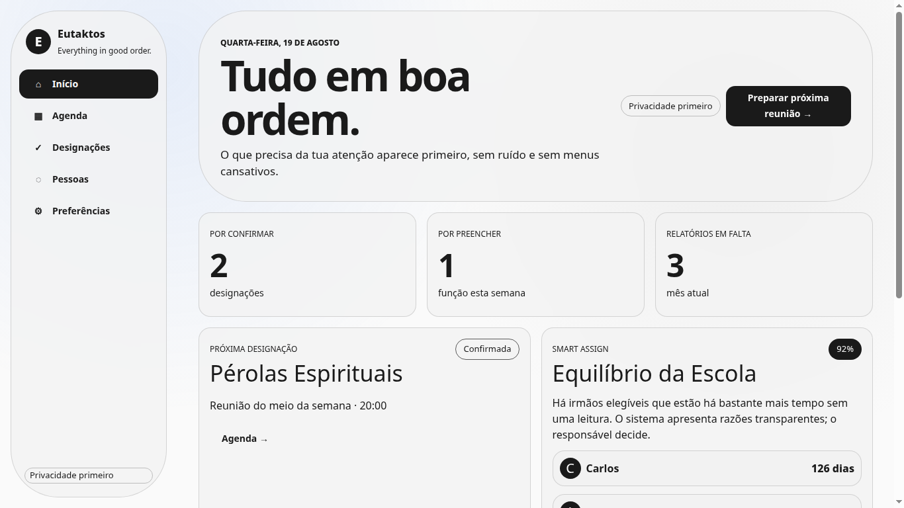
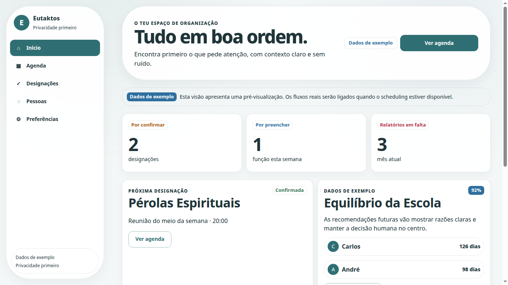
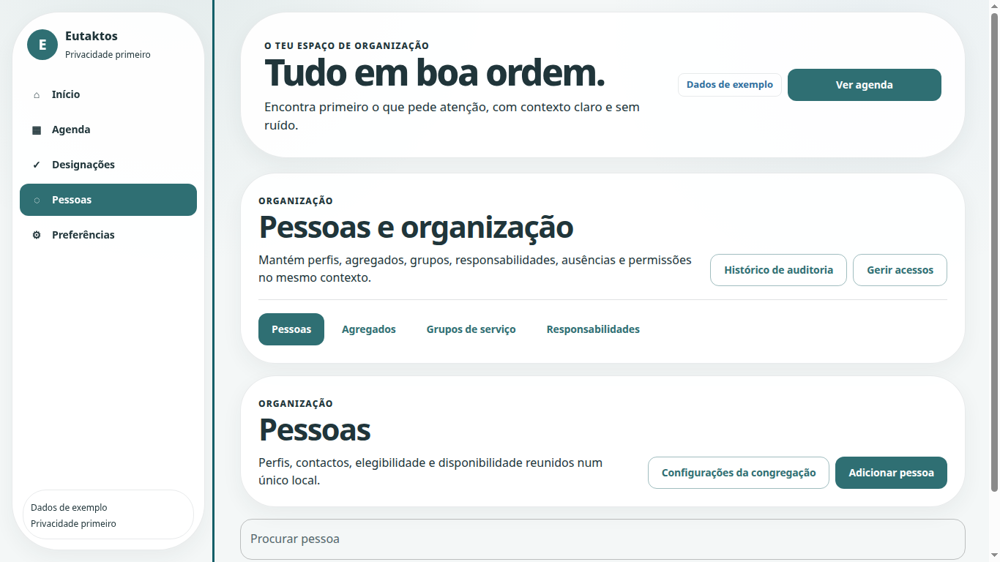
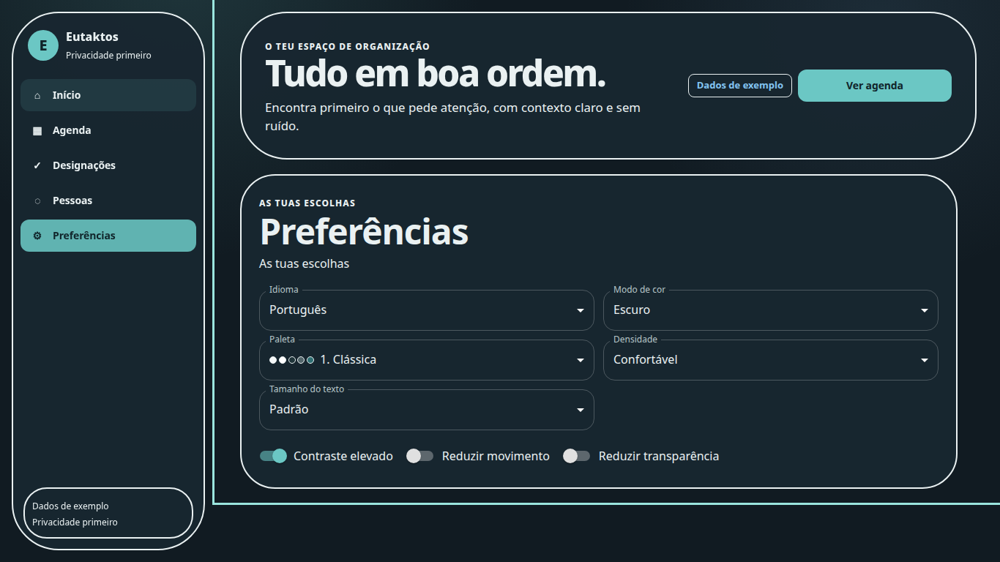

# Eutaktos — Reformulação coordenada de Produto, UX e UI

**Autor:** Manus AI  
**Base reavaliada:** `main` em `c794c30a08e788cd5edb020c5b3915c057a77dbf`  
**Escopo:** reformulação de UX/UI, acessibilidade, localização e PWA; sem alterações à lógica espiritual, eligibility, tenancy, permissões, segredos, DNS ou infraestrutura externa.

## Resumo executivo

A interface foi reorganizada como um único sistema de produto: uma identidade azul-petróleo calma, superfícies claras ou navy em camadas, estados semânticos discretos e uma navegação que se adapta de mobile a desktop. A reforma elimina a associação indevida entre `primary` e texto preto, reduz a sensação de grelha de cartões e faz a diferença entre **dados demonstrativos**, **previews** e fluxos realmente disponíveis.

A correção também resolve o bloqueador P0 identificado na auditoria: o controlador PWA já não tenta construir o URL do service worker a partir de uma base relativa sem origem. A build de produção é agora aberta e verificada num navegador headless, confirmando que o contêiner React é preenchido quando `BASE_URL` é relativa.

## Comparativo antes/depois

| Superfície | Antes | Depois |
|---|---|---|
| Identidade | CTAs, navegação ativa e texto partilhavam preto quase puro | `primary` azul-petróleo passou a representar identidade e ação; texto permanece um token autónomo |
| Superfícies | Muitas bordas e cartões visualmente equivalentes | Fundo sereno, superfícies em camadas, bordas subtis e sombra controlada |
| Mobile 320 px | Cinco rótulos comprimidos e scroll horizontal visível | Quatro destinos legíveis — Início, Agenda, Pessoas e Mais — com destinos secundários no painel Mais |
| Dashboard | Demonstração visualmente próxima de produto funcional | Dados identificados como exemplo; Agenda e planeamento são encaminhados como previews explícitos |
| Pessoas e organização | Superfícies recentes sem enquadramento único | Navegação comum para Pessoas, Agregados, Grupos e Responsabilidades; ausências por pessoa e ações administrativas secundárias |
| Dark mode | Tema escuro minimalista sem identidade correlata | Navy/carvão em camadas, teal claro para ações e alto contraste sem fundo preto puro |

| Antes — mobile | Depois — mobile |
|---|---|
|  |  |

| Antes — desktop | Depois — desktop |
|---|---|
|  |  |

## Achados da auditoria

| Situação | Estado | Evidência e decisão |
|---|---|---|
| `primary.main` usava a cor de texto | **Resolvido** | As seis paletas passam a ter cores de ação próprias. A clássica usa `#2F6F73`; o texto é `#20353A`. |
| Produção apresentava ecrã em branco com `BASE_URL` relativa | **Resolvido** | `resolvePwaScriptUrl` produz um URL absoluto a partir de `window.location.origin`; há teste unitário e teste de montagem da build real. |
| Navegação 320 px comprimia cinco labels | **Resolvido** | A barra móvel expõe quatro destinos e um painel Mais; a verificação runtime valida ausência de overflow horizontal. |
| CTA quebrava de forma desigual perto de 1024 px | **Resolvido** | O cabeçalho muda de composição antes do limite desktop, sem reduzir simplesmente a fonte. |
| Agenda e Designações aparentavam ações disponíveis | **Resolvido** | Permanecem previews explícitos e não apresentam botões de detalhe desativados ou ações simuladas. |
| People, Households, Groups e Responsibilities ausentes | **Não aplicável** | A `main` atual já integra estas superfícies; a reforma passou a tratá-las como módulo organizacional único. |
| Ausências não estavam visíveis no módulo | **Resolvido** | As ausências são abertas no contexto da pessoa selecionada, em vez de inventar um destino sem seleção. |
| Endpoints organizacionais não publicados no deploy | **Bloqueado externamente** | A UI mostra erro localizado e recuperável. Não foram criados dados falsos, proxies inseguros, nem alteradas configurações externas. |

## Sistema de design

As seis opções permanecem disponíveis, mas agora são variações da mesma identidade e não seis produtos incongruentes: **Clássica**, **Acolhedora**, **Calma**, **Foco**, **Noturna** e **Alto contraste**. Todas conservam a mesma hierarquia tipográfica, comportamento de estados, superfícies e contraste mínimo. O modo claro/escuro/sistema é agora uma preferência própria, persistida com validação estrita.

Os tokens de estado incluem sucesso, pendência, aviso, erro, informação, inativo, rascunho e confirmação. O tema utiliza os papéis semânticos nativos do MUI para sucesso, aviso, erro e informação, e os restantes tokens estão disponíveis no design system. Chips deixam de usar preto de forma genérica.

## Responsividade e acessibilidade

A navegação é mobile-first, respeita `safe-area-inset-bottom` e mantém alvos de toque de pelo menos 44 px. Em mobile, o painel Mais mantém destinos secundários descobertos sem reduzir os labels a um estado ilegível. Em desktop, a navegação lateral e o conteúdo usam a mesma linguagem visual.

O tema fornece foco visível de 3 px, reflow a 320 px, apoio para `prefers-reduced-motion`, redução de transparência, modo de alto contraste e `forced-colors`. Os diálogos ganham margem e largura adequadas em larguras abaixo de 360 px. As preferências incluem tamanho de texto até **Muito grande**, densidade e contraste elevado.

## Internacionalização

O shell, navegação, dashboard, preview, preferências, estados de Pessoas e mensagens de falha foram revistos em **pt-PT**, **en** e **es**. A verificação runtime carrega a aplicação nas três línguas, confirma o idioma em `html[lang]` e procura os títulos traduzidos em cada versão. O projeto já mantém uma função de direção textual; a composição evita pressupostos de alinhamento físico que impeçam evolução para RTL.

## PWA e recuperação

O componente PWA é montado dentro do `App`, sob o tema ativo. Continua a manter instalação controlada, `SKIP_WAITING`, atualização manual e anúncio `aria-live="polite"`; a resolução do script de service worker passou a aceitar `/`, `/app` e subdiretórios sem lançar `Invalid base URL`.

## Testes e validação

| Verificação | Resultado |
|---|---|
| Typecheck de todos os workspaces | Aprovado |
| Suites unitárias de todos os workspaces | Aprovadas; a suite web inclui 74 testes |
| Contraste e tokens de tema | Aprovados para as seis paletas, texto e CTA primário |
| Preferências claro/escuro/sistema | Aprovadas, incluindo normalização de valores persistidos |
| PWA controller e URL relativa | Aprovados; 8 testes específicos |
| Montagem de production build | Aprovada num preview real com Chromium headless |
| Interação runtime de UX | Aprovada: pt-PT/en/es, dark/high-contrast, navegação Mais e reflow em 320 px |
| Build de produção | Aprovada; permanece apenas o aviso não bloqueante de bundle acima de 500 kB |
| Auditoria de dependências | 0 vulnerabilidades; o ambiente local emite somente aviso de versão Node 22 face ao requisito `>=24` |

## Viewports testados

A avaliação visual e/ou runtime abrangeu 320 × 568, 1024 × 768 e 1366 × 768 nesta entrega, além dos breakpoints responsivos do MUI. A verificação runtime prova reflow sem overflow em 320 px; as restantes dimensões previstas devem continuar a ser incluídas na validação de regressão visual contínua à medida que o Scheduling Core for integrado.

## Limitações conhecidas e bloqueadores externos

O conteúdo de Agenda, Designações e métricas do dashboard continua identificado como demonstrativo até que os fluxos reais do Scheduling Core sejam integrados. As tarefas K21–K40 do Kimi não foram modificadas. A indisponibilidade de APIs organizacionais no deploy requer publicação de backend/funções pela equipa responsável; esta reforma não contorna tenant isolation, permissões ou infraestrutura com dados falsos.

> O resultado não transforma previews em funcionalidades prontas. Em vez disso, a interface comunica honestamente o estado atual do produto e está preparada para receber os fluxos reais sem perder coerência visual ou semântica.
