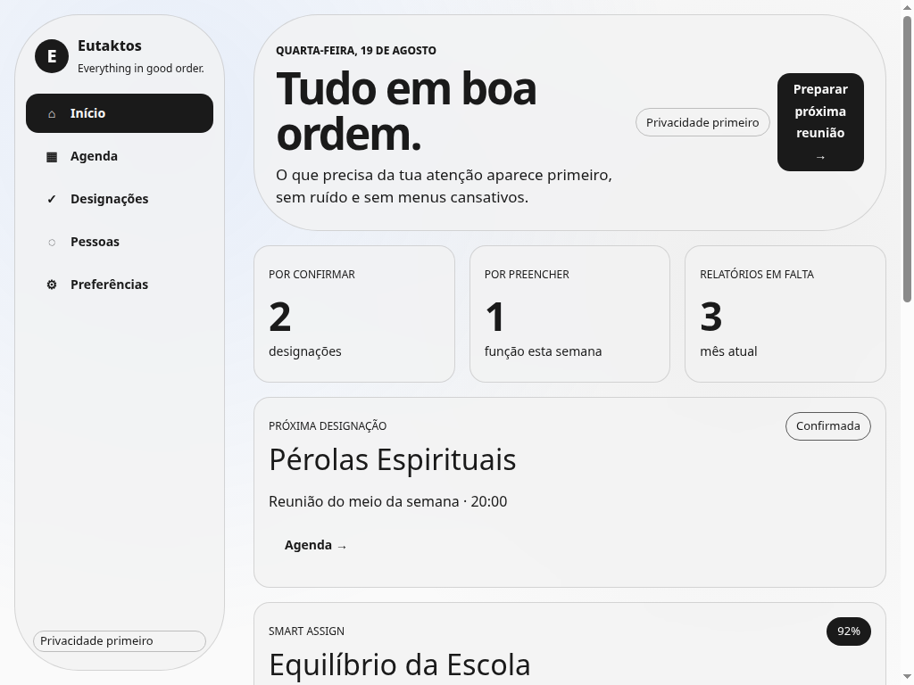
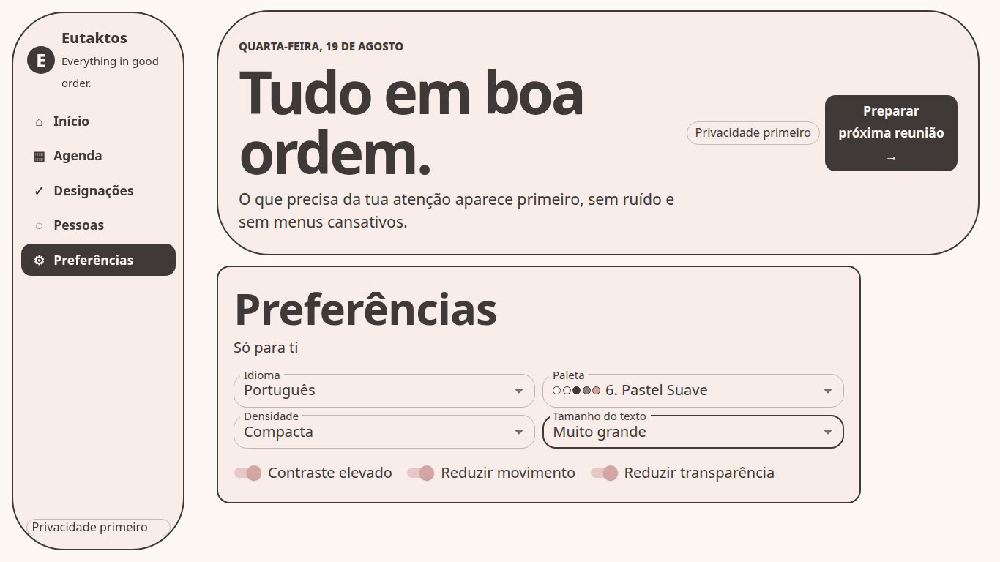
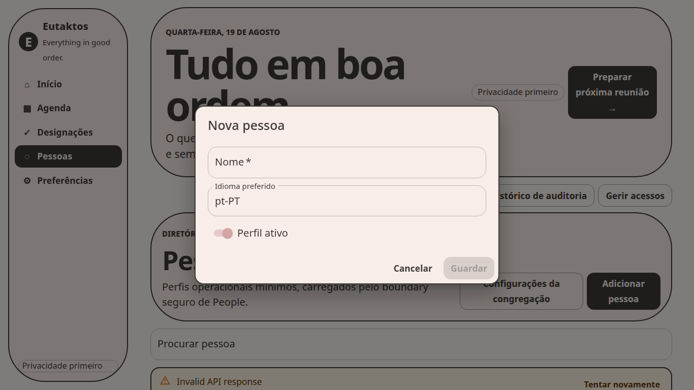

# Auditoria de produto, UX, acessibilidade e responsividade

**Autor:** Manus AI  
**Data:** 21 de agosto de 2026  
**Referência auditada:** `main` em `4ca7158`  
**Produção observada:** <https://eutakes.netlify.app/>  
**Âmbito da alteração:** este commit acrescenta somente este relatório e as suas capturas de evidência. Não altera código de produção, configuração de deploy ou dados.

## Síntese executiva

A versão publicada tem um bloqueador **P0**: a aplicação responde com o documento HTML e os recursos estáticos, mas deixa `#root` vazio e mostra uma página totalmente branca. A falha foi reproduzida com o build de produção local. O diagnóstico observável é `Uncaught TypeError: Failed to construct 'URL': Invalid base URL`; o caminho provável é o construtor de URL usado pelo controlador de atualização PWA. Enquanto este bloqueador existir, a navegação, o dashboard, as preferências, os fluxos de People e a instalação PWA não estão utilizáveis na produção atual.[6]

A interface que é renderizada em desenvolvimento tem uma base visual consistente, navegação acessível e preferências operáveis. O teste controlado confirmou os três idiomas, as seis paletas, tamanho de texto, densidade, contraste elevado, redução de movimento e redução de transparência. Contudo, a maior parte da experiência de produto ainda é uma maquete: Agenda e Designações são explicitamente marcadas como `Preview` e os respetivos botões de detalhes não executam ação. Pessoas contém fluxos descobríveis, mas a produção não disponibiliza os endpoints da API necessários; as consultas observadas devolvem 404 e a UI expõe a mensagem técnica não localizada `Invalid API response`.[4] [5]

> O README declara o estado do projeto como **“Planning / engineering foundation. No production release exists yet.”** A auditoria, portanto, não trata a ausência de domínios de fases posteriores como falha do produto atual. Trata como falha apenas aquilo que o código e a UI já expõem como funcional na versão auditada.[1]

| Indicador | Resultado |
|---|---|
| Bloqueadores P0 | **1** — ecrã branco na produção |
| Problemas P1 | **4** — PWA/update, UI de People sem backend, ações Preview inertes, navegação móvel muito densa a 320 px |
| Problemas P2 | **3** — localização residual em inglês, CTA estreito a 1024 px, estados de erro/vazio simultâneos |
| Controlos de preferências verificados localmente | **11** — 3 idiomas, 6 paletas, 2 preferências de dimensão/densidade, mais 3 switches de acessibilidade |
| Viewports observados | **9** — de 320 × 568 a 1920 × 1080 |
| Alterações de código de produto feitas nesta tarefa | **0** |

## Método e critérios de classificação

A matriz abaixo cruza a `main` atual, as PRs já integradas no histórico dessa `main`, o README e os registos de funcionalidades, roadmap e backlog. O critério não foi “o código existe”; foi **“um utilizador consegue alcançar e usar esta capacidade na versão atual”**. A documentação coloca a plataforma PWA, acessibilidade, internacionalização, preferências e segurança de base nas primeiras fases; as áreas de agenda, designações e operações alargadas continuam dependentes de fases posteriores.[2] [3] [7] [8]

| Classe de expectativa | Regra aplicada na auditoria | Exemplos nesta versão |
|---|---|---|
| **IMPLEMENTADO E DEVERIA FUNCIONAR AGORA** | A UI ou o runtime expõem a funcionalidade como fluxo atual, e a versão tem de a montar sem erro. | Carregamento da shell, navegação principal, Preferências, diálogos expostos de People, tratamento de estados, manifest/service worker. |
| **IMPLEMENTADO PARCIALMENTE** | Existe UI ou código operacional, mas faltam backend, integração, ação de utilizador ou caminho completo. | Dashboard demonstrativo, Agenda e Designações `Preview`, People sem API publicada, PWA update/recovery. |
| **PLANEADO, MAS AINDA NÃO IMPLEMENTADO** | Está documentado em roadmap/backlog/feature registry, mas não é apresentado pelo produto atual como fluxo completo. | Away periods, disponibilidade operacional, responsabilidades, hospitalidade, relatórios, territórios, Smart Assign real, Review Center, assistente e operações P2/P3. |

A produção foi aberta como utilizador normal. O HTML, o bundle, o CSS, o manifest e o ícone devolveram HTTP 200; ainda assim, o contêiner raiz ficou vazio. O mesmo cenário foi reproduzido com `vite preview` e Chromium headless. Para não inventar resultados, os fluxos impossibilitados pelo bloqueador foram classificados como **BLOQUEADA PELO DEPLOY**, e a UI foi observada adicionalmente em desenvolvimento, sem alterações ao código. A auditoria não criou pessoas, não submeteu formulários, não alterou dados e não concedeu capabilities.

## Evidência visual

A primeira captura demonstra a indisponibilidade da produção. As restantes são evidência da UI atual em ambiente local controlado, necessária para diferenciar o bloqueador de deploy de problemas de interface.

## Matriz funcional detalhada

### Implementado e deveria funcionar agora

| Funcionalidade | Teste executado | Estado | Evidência e interpretação |
|---|---|---|---|
| Carregamento da aplicação publicada | Abertura da URL pública; inspeção de DOM, recursos e consola; reprodução no build local de produção | **FAIL** | `#root` permanece vazio apesar de HTML e bundle carregarem. Chromium reproduziu `Invalid base URL`; o fluxo PWA forma o candidato direto à causa.[6] |
| Navegação principal | Inspeção e interação local da barra lateral/rodapé | **BLOQUEADA PELO DEPLOY** | A navegação monta localmente e contém cinco destinos. Na produção não existe UI para a acionar.[4] |
| Dashboard | Observação local em desktop e móvel | **PARTIAL** | O dashboard é alcançável, mas os números, pessoas e percentagens são conteúdos estáticos de demonstração, não um estado operacional ligado a dados.[4] |
| Idiomas pt-PT, en e es | Seleção real no controlo de idioma; verificação de `document.lang` e textos principais | **BLOQUEADA PELO DEPLOY** | Os três idiomas funcionam localmente. A marca lateral mantém “Everything in good order.” em inglês em pt-PT e es, pelo que a localização não está completa.[4] |
| Seis paletas | Seleção real de Classic, Warm, Green, Blue, Dark e Pastel; verificação de paleta, fundo e `color-scheme` | **BLOQUEADA PELO DEPLOY** | As seis opções funcionam localmente; Dark produz `color-scheme: dark`. A produção permanece indisponível.[4] [7] |
| Light, dark e system | Inspeção do modelo e dos controlos expostos | **PARTIAL** | Existe uma paleta dark fixa, mas não há modo light/dark independente nem opção `system` na UI. O README promete os três modos.[1] [4] |
| Tamanho do texto e densidade | Seleção real de “Muito grande” e “Compacta” | **BLOQUEADA PELO DEPLOY** | O texto extra-grande fez a raiz passar para 20 px e a densidade alterou os controlos localmente. O estado é persistido no browser pela app.[4] [7] |
| Contraste elevado | Ativação do switch e leitura de estilos | **BLOQUEADA PELO DEPLOY** | O modo aplicou bordas de 2 px e manteve os controlos legíveis localmente.[4] [7] |
| Reduced motion | Ativação do switch e verificação do estado | **BLOQUEADA PELO DEPLOY** | O controlo existe e fica selecionado; o tema elimina transições em modo reduzido.[4] [7] |
| Reduced transparency | Ativação do switch e leitura de estilo | **BLOQUEADA PELO DEPLOY** | O `backdrop-filter` passa a `none`, conforme esperado.[4] [7] |
| Navegação mobile e desktop | Nove viewports: 320, 360, 390, 412, 768, 1024, 1366, 1440 e 1920 px | **PARTIAL** | Não há overflow técnico. A 320 px, cinco itens têm cerca de 58,6 × 51 px, mas Designações e Preferências ficam demasiado comprimidos para leitura rápida. A 1024 px o CTA do cabeçalho quebra excessivamente. |
| Semântica básica e foco | Inspeção do DOM e dos componentes | **PARTIAL** | Há skip link, `<main>`, `aria-current`, labels e contorno de foco. Teste manual de teclado, leitor de ecrã, VoiceOver/TalkBack e zoom não foi possível neste ambiente, logo não é uma aprovação WCAG.[4] [7] |
| PWA/installability e update/recovery | Manifest e recursos em produção; build local; inspeção do controlador de atualização | **FAIL** | O manifest e os ícones existem, mas o caminho de update/recovery causa o bloqueador que impede a montagem. Logo a capacidade PWA não está utilizável hoje.[6] |

### Implementado parcialmente

| Funcionalidade | Estado | Evidência e problema associado |
|---|---|---|
| Agenda | **PARTIAL** | É alcançável pela UI, mas a própria secção é `Preview`. Os cartões apresentam dados estáticos e `Ver detalhes` não tem handler.[4] |
| Designações | **PARTIAL** | É alcançável pela UI, mas é `Preview`; não há criação, conflito, confirmação nem navegação para detalhes.[4] |
| People Directory | **BLOQUEADA PELO DEPLOY** | A UI tem loading, erro, vazio, pesquisa e cartões. A API publicada `/api/people` devolve 404; em desenvolvimento a UI mostra `Invalid API response` e vazio simultaneamente.[5] |
| Criar pessoa | **BLOQUEADA PELO DEPLOY** | O diálogo é descobrível, tem Nome, Idioma preferido e Perfil ativo, e Guardar fica inativo sem nome. A criação não foi submetida; o endpoint não está publicado. |
| Contactos de emergência | **NÃO TESTÁVEL** | O botão só surge para uma pessoa carregada; sem backend e sem criação artificial de dados não foi possível alcançar o diálogo.[5] |
| Elegibilidade | **NÃO TESTÁVEL** | Está exposta por pessoa, mas depende do diretório funcional e de uma pessoa selecionável.[5] |
| Configurações da congregação | **BLOQUEADA PELO DEPLOY** | O diálogo abre, mostra campos de nome, timezone, idioma e horários, mas a persistência requer a API indisponível. |
| Histórico de auditoria | **BLOQUEADA PELO DEPLOY** | O diálogo abre e expõe filtros, mas recebe `Invalid API response` e nenhum evento. |
| Gestão de acessos/capabilities | **BLOQUEADA PELO DEPLOY** | O diálogo explica corretamente capabilities explícitas e não inferência automática, mas falha ao listar pessoas, impedindo consulta/alteração.[4] |
| Estados loading/error/empty | **PARTIAL** | O código apresenta os três estados. No erro observado, mostra simultaneamente alerta técnico e “Nenhuma pessoa encontrada”, confundindo indisponibilidade com diretório vazio.[5] |

### Planeado, mas ainda não implementado como produto atual

As funcionalidades seguintes constam de roadmap/backlog/feature registry, mas não são tratadas como falhas desta auditoria porque a versão atual não oferece um caminho utilizável para elas: disponibilidade e away periods, responsabilidades, serviço de campo, relatórios, territórios, hospitalidade, informação alargada, agendas personalizadas, Smart Assign real, Review Center e assistente. A ausência destas áreas é coerente com as fases de dados, scheduling, experiência de publicador e paridade alargada ainda previstas na documentação.[2] [3] [8]

| Área pedida para a revisão | Classificação | Razão para não penalizar a versão atual |
|---|---|---|
| Away periods e disponibilidade operacional | **PLANEADO, MAS AINDA NÃO IMPLEMENTADO** | O modelo é P1 de dados, mas não existe fluxo acessível no produto atual.[2] [3] |
| Agenda e designações reais | **PLANEADO, MAS AINDA NÃO IMPLEMENTADO** | O roadmap coloca o core de scheduling numa fase posterior; a UI atual declara Preview.[2] [4] |
| People Directory com dados reais, contactos, eligibility e configuração persistida | **IMPLEMENTADO PARCIALMENTE** | O front-end está exposto, mas o backend/deploy necessário não existe na URL auditada.[5] |
| Auditoria e capabilities efetivas | **IMPLEMENTADO PARCIALMENTE** | A superfície de UI existe, mas não pode listar pessoas ou eventos sem API. |
| PWA update/recovery funcional | **IMPLEMENTADO PARCIALMENTE** | Existe código e UI para recovery, porém introduz a falha que impede a app. |
| Operações P2/P3: board, hospitalidade, documentos, schedules personalizados e inteligência | **PLANEADO, MAS AINDA NÃO IMPLEMENTADO** | São fases de paridade e inteligência futuras.[2] [3] |

## Problemas priorizados

| Prioridade | Problema | Impacto no utilizador | Correção recomendada |
|---|---|---|---|
| **P0** | A produção fica em ecrã branco devido a `new URL('sw.js', import.meta.env.BASE_URL)` com base relativa | Não há produto utilizável, navegação, PWA nem fallback de erro | Construir o URL com uma base absoluta, por exemplo `new URL('sw.js', window.location.origin + import.meta.env.BASE_URL)`, acrescentar teste de montagem em build de produção e publicar novamente.[6] |
| **P1** | API não está publicada/roteada no deploy Netlify | People, criação, configuração, contactos, audit e capabilities não concluem qualquer fluxo | Ligar o deploy ao backend autenticado ou configurar proxies/functions; devolver erros localizados e acionáveis, não `Invalid API response`. |
| **P1** | Agenda e Designações apresentam ações inertes | O utilizador encontra botões de detalhes que não levam a lugar nenhum | Desativar/rotular explicitamente ações ainda não disponíveis ou implementar os destinos antes de apresentar as ações. |
| **P1** | Navegação inferior excessivamente densa a 320 px | Os destinos mais longos perdem leitura rápida, apesar de os targets terem dimensão suficiente | Usar rótulos abreviados, permitir duas linhas controladas, aumentar a largura útil ou adotar uma navegação compacta com menu complementar. |
| **P2** | Localização incompleta | A marca lateral e a mensagem de erro permanecem em inglês em pt-PT/es | Mover a marca e os erros de API para catálogo de i18n e testar cada locale com estados de erro. |
| **P2** | Erro e vazio apresentados em simultâneo | O utilizador não sabe se não existem pessoas ou se o servidor falhou | Em erro, não renderizar o estado vazio; apresentar somente a mensagem localizada e ação de retry. |
| **P2** | CTA em 1024 px quebra em três linhas | Reduz clareza e acabamento do cabeçalho em laptop/tablet landscape | Ajustar largura mínima, tipografia ou breakpoint do cabeçalho. |

## Limites da evidência

A auditoria não afirma que os fluxos de backend estão seguros ou corretos: a produção não expõe API funcional e nenhum dado foi criado. Também não substitui testes com leitores de ecrã, teclado humano, TalkBack, VoiceOver, instalação real em Android/iOS ou teste de atualização de service worker num dispositivo persistente. Esses pontos permanecem **NÃO TESTÁVEIS** até o P0 ser corrigido e existir um ambiente integrado com autenticação e dados de teste descartáveis.

## O que já deveria funcionar hoje

Esta tabela é o critério de saída recomendado para a próxima revisão. Inclui apenas capacidades que a versão atual já expõe na UI ou no runtime; ausência de fases futuras não é contabilizada como falha.

| Funcionalidade | Estado atual | Evidência | Problema associado |
|---|---|---|---|
| Carregar a aplicação publicada | **FAIL** | URL de produção e build local deixam `#root` vazio; exceção `Invalid base URL` | **P0** — controlador PWA impede montagem |
| Navegação principal | **BLOQUEADA PELO DEPLOY** | Monta localmente com cinco destinos; impossível na produção branca | Dependência do P0 |
| Dashboard | **PARTIAL** | UI renderiza cartões estáticos | Não representa dados do utilizador |
| Agenda | **PARTIAL** | Secção acessível e marcada `Preview` | Detalhes inertes; sem agenda real |
| Designações | **PARTIAL** | Secção acessível e marcada `Preview` | Sem operações, confirmação ou conflitos reais |
| Pessoas / People Directory | **BLOQUEADA PELO DEPLOY** | UI e pesquisa existem; `/api/people` devolve 404 | API não publicada; erro técnico e vazio simultâneos |
| Criar pessoa | **BLOQUEADA PELO DEPLOY** | Formulário abre e valida nome vazio | Sem endpoint disponível; não submetido |
| Contactos de emergência | **NÃO TESTÁVEL** | Requer pessoa carregada | Diretório/API indisponíveis |
| Disponibilidade / away periods | **NÃO TESTÁVEL** | Sem rota ou fluxo atual | Planeado, não penalizado |
| Eligibility | **NÃO TESTÁVEL** | Exposta por pessoa, mas sem pessoa carregada | Diretório/API indisponíveis |
| Configurações da congregação | **BLOQUEADA PELO DEPLOY** | Diálogo e campos abrem | Persistência/API indisponível |
| Histórico de auditoria | **BLOQUEADA PELO DEPLOY** | Diálogo e filtros abrem | Endpoint devolve erro técnico |
| Gestão de acessos/capabilities | **BLOQUEADA PELO DEPLOY** | Diálogo acessível e sem inferência automática | Não lista pessoas sem backend |
| Idiomas pt-PT / en / es | **BLOQUEADA PELO DEPLOY** | Seleção local atualiza `lang` e os textos principais | Produção indisponível; marca residual em inglês |
| Light / dark / system | **PARTIAL** | Seis paletas e dark funcionam localmente | Não há modo `system` nem switch light/dark separado |
| Seis paletas | **BLOQUEADA PELO DEPLOY** | Todas selecionadas localmente; dark usa `color-scheme: dark` | Produção indisponível |
| Tamanho de texto | **BLOQUEADA PELO DEPLOY** | “Muito grande” aplica 20 px na raiz local | Produção indisponível |
| Densidade | **BLOQUEADA PELO DEPLOY** | Compacta selecionável localmente | Produção indisponível |
| Contraste elevado | **BLOQUEADA PELO DEPLOY** | Bordas de 2 px aplicadas localmente | Produção indisponível |
| Reduced motion | **BLOQUEADA PELO DEPLOY** | Switch operacional localmente | Produção indisponível |
| Reduced transparency | **BLOQUEADA PELO DEPLOY** | `backdrop-filter: none` localmente | Produção indisponível |
| PWA/installability | **FAIL** | Manifest existe, mas runtime não monta | **P0** no update/recovery |
| Atualização/recovery do service worker | **FAIL** | Caminho de recovery é fonte provável da exceção | **P0** — corrigir URL e cobrir em teste de produção |
| Mobile e desktop | **PARTIAL** | 9 viewports; sem overflow técnico | Navegação demasiado densa a 320 px; CTA quebra a 1024 px |
| Loading / error / empty | **PARTIAL** | Estados existem na UI | Erro e vazio simultâneos; mensagem não localizada |

## Referências

[1]: https://github.com/bfrpaulondev/eutaktos/blob/4ca7158/README.md#L22-L64 "README — PWA, acessibilidade e estado do projeto"
[2]: https://github.com/bfrpaulondev/eutaktos/blob/4ca7158/docs/FEATURES.md "Feature registry"
[3]: https://github.com/bfrpaulondev/eutaktos/blob/4ca7158/docs/ROADMAP.md "Roadmap por fases"
[4]: https://github.com/bfrpaulondev/eutaktos/blob/4ca7158/apps/web-pwa/src/App.tsx "App shell, navegação e preferências"
[5]: https://github.com/bfrpaulondev/eutaktos/blob/4ca7158/apps/web-pwa/src/PeopleDirectory.tsx "People Directory e estados de UI"
[6]: https://github.com/bfrpaulondev/eutaktos/blob/4ca7158/apps/web-pwa/src/PwaUpdateRecovery.tsx#L70-L97 "PWA update and recovery"
[7]: https://github.com/bfrpaulondev/eutaktos/blob/4ca7158/apps/web-pwa/src/theme.ts "Tema, paletas e preferências de acessibilidade"
[8]: https://github.com/bfrpaulondev/eutaktos/blob/4ca7158/docs/BACKLOG.md "Backlog de produto"
